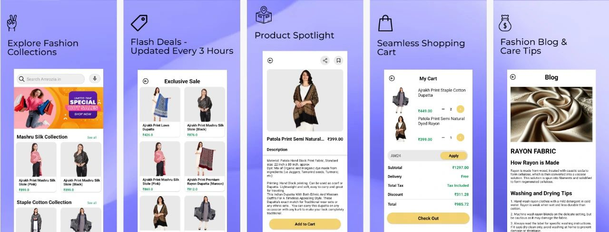

# Amrozia Shopping App

Amrozia is a robust, Java-based shopping app engineered to deliver a seamless online shopping experience. Leveraging Firebase for real-time data syncing, authentication, and notifications, alongside Cashfree for smooth payment processing, Amrozia offers an intuitive platform for both customers and administrators. The app includes dynamic pricing, order and product management, and exclusive sales notifications, making it highly efficient and user-friendly.

## Features

### 1. **Real-Time Data Syncing**
   - Integrated Firebase for real-time updates, ensuring users have instant access to the latest product listings and order statuses.
   - Efficient order management with real-time syncing across multiple devices.

### 2. **Authentication & Security**
   - Firebase Authentication ensures secure user sign-ups and logins.
   - Includes password recovery options for enhanced security.

### 3. **Order & Product Management**
   - Comprehensive order tracking system allowing users to track their orders from placement to delivery.
   - Product management tools for administrators streamline product listing.

### 4. **Payment Processing**
   - Integrated **Cashfree** for secure and seamless payment processing.
   - Supports multiple payment methods including credit/debit cards, UPI, and wallets.

### 5. **Dynamic Pricing & Notifications**
   - Boosts user engagement through dynamic pricing and personalized notifications.
   - Exclusive sale notifications keep customers informed about the latest discounts and deals.

### 6. **Optimized Shopping Flow**
   - Checkout process optimized to improve speed by **35%**, resulting in a faster and smoother user experience.
   - Streamlined product search and filtering options.

## Tech Stack

- **Java**: Core language used for building the app.
- **Firebase**: 
  - Authentication for secure logins.
  - Firestore for real-time database syncing.
  - Cloud Messaging for push notifications.
- **Cashfree**: Integrated for seamless payment processing.
- **Android SDK**: Used for Android-specific development and UI components.

## Screenshots

Below is a screenshot showcasing the app's UI:

## Google Play Store

You can download the app on the Google Play Store:

